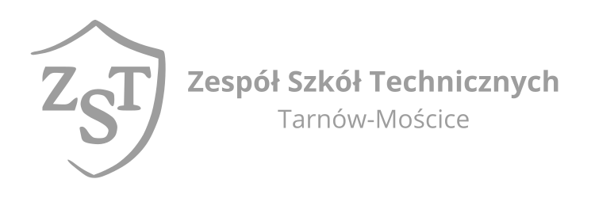

# Strona główna

**Unoverse Networks** to platforma na której można znaleźć instrukcje dotyczące obsługi urządzeń i usług sieciowych na kierunku technik informatyk (INF.02). 

!!! info
    Platforma jest tworzona na bieżąco i uaktualniana o nowe treści

!!! question "FAQ"
    - **Jak jest zbudowana platforma?**  
    Po lewej stronie można znaleźć spis treści podzielony na kategorie.  
    W kategoriach znajdują się pojedyncze tematy z opisami i zrzutami ekranu.

    - **Kiedy pojawi się nowy temat?**  
    Jak będzie to będzie. Platforma jest w fazie rozwojowej.

    - **Najbliższe tematy:**  
        - MikroTik: Bridge
        - MikroTik: Firewall
        - MikroTik: OSPF
        - Linux: Network Manager
        - Linux: netplan
        - Linux: bind9
        - Linux: isc-dhcp-server
        - Linux: iptables

!!! quote "Autor"
    Marcin Madanowicz <[marcin@madanowicz.pl](mailto:marcin@madanowicz.pl)>  
    
    { width="200" loading=lazy .off-glb }

    
