# DHCP

## Podstawowe ustawienia DHCP

- Z menu po lewej stronie wybierz zakładkę IP :material-numeric-1-circle:
- Wybierz opcję DHCP Server :material-numeric-2-circle:

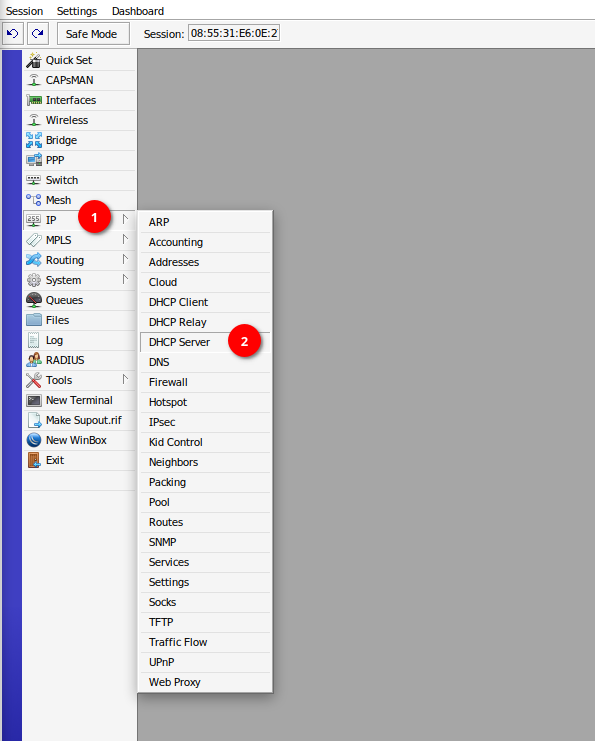{ loading=lazy }

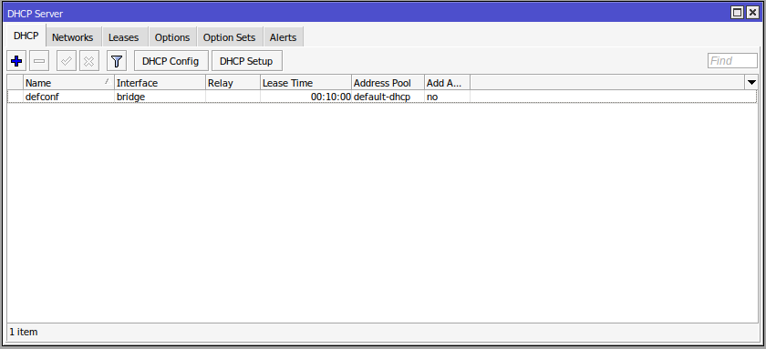{ loading=lazy }

## Zmiana adresu IP bramy domyślnej

- Przejdź do zakładki Networks :material-numeric-1-circle:
- Wybierz konfigurację domyślnego serwera DHCP :material-numeric-2-circle:

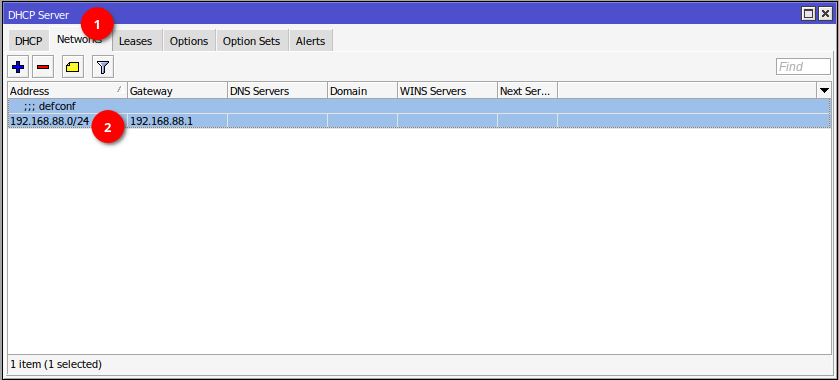{ loading=lazy }

- W polu Address wpisz adres sieci, w której pracuje router (ustawionej [tutaj](https://beta-networks.unoverse.pl/mikrotik/ip/#zmiana-adresu-ip-lan-routera)) razem z maską. :material-numeric-1-circle:
- W polu Gateway wpisz adres IP routera, który pełni rolę bramy. W tym przypadku jest to adres tego routera. :material-numeric-2-circle:
- Naciśnij Apply :material-numeric-3-circle: oraz OK :material-numeric-4-circle:, aby zamknąć okno.

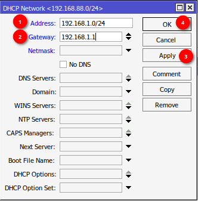{ loading=lazy }

## Zmiana długości maski

- Przejdź do zakładki Networks :material-numeric-1-circle:
- Wybierz konfigurację domyślnego serwera DHCP :material-numeric-2-circle:

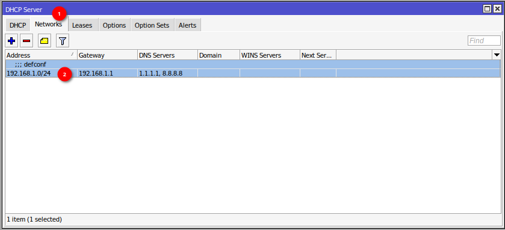{ loading=lazy }

- W polu Netmask wpisz długość maski, która ma być przydzielana klientom przez serwer DHCP :material-numeric-1-circle:
- Naciśnij Apply :material-numeric-2-circle: oraz OK :material-numeric-3-circle:, aby zamknąć okno.

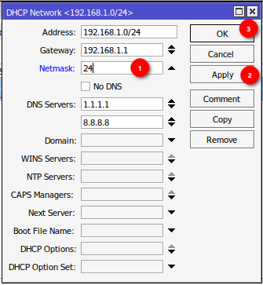{ loading=lazy }

## Pula adresów serwera DHCP

- Z menu po lewej stronie wybierz zakładkę IP :material-numeric-1-circle:
- Wybierz opcję Pool :material-numeric-2-circle:

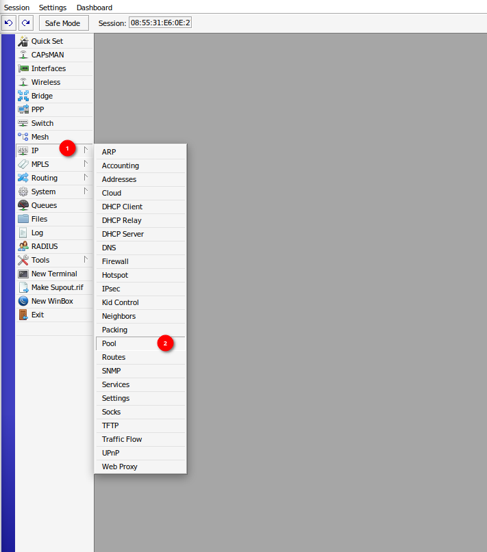

- Wybierz domyślną pulę adresów `default-dhcp` :material-numeric-1-circle:

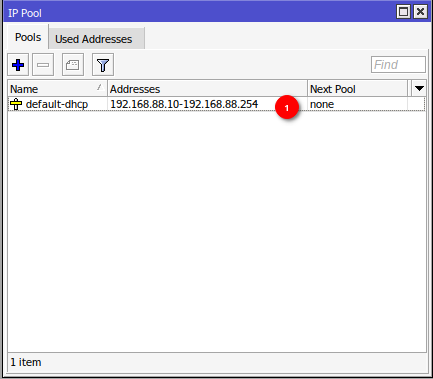

- W polu Addresses wpisz zakres, który ma być przydzielany :material-numeric-1-circle: (przykładowo 192.168.1.100-192.168.1.150)
- Naciśnij Apply :material-numeric-2-circle: oraz OK :material-numeric-3-circle:, aby zamknąć okno.

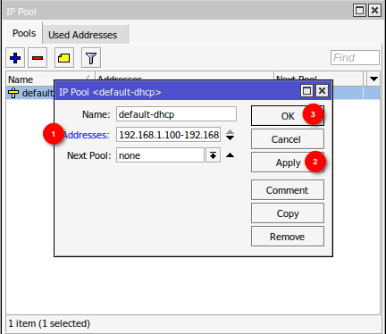

- Upewnij się, czy w DHCP Server -> DHCP :material-numeric-1-circle: -> Address Pool :material-numeric-2-circle: ustawiona jest pula `default-dhcp`

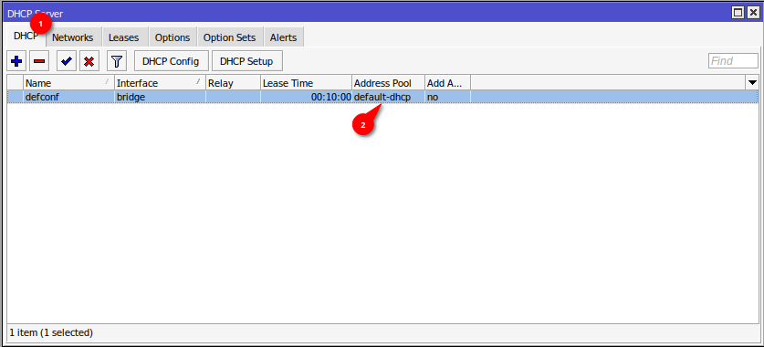{ loading=lazy }

## Ustawienie przydzielanego serwera DNS

- Z menu po lewej stronie wybierz zakładkę IP :material-numeric-1-circle:
- Wybierz opcję DHCP Server :material-numeric-2-circle:

{ loading=lazy }

- Przejdź do zakładki Networks :material-numeric-1-circle:
- Wybierz konfigurację domyślnego serwera DHCP :material-numeric-2-circle:

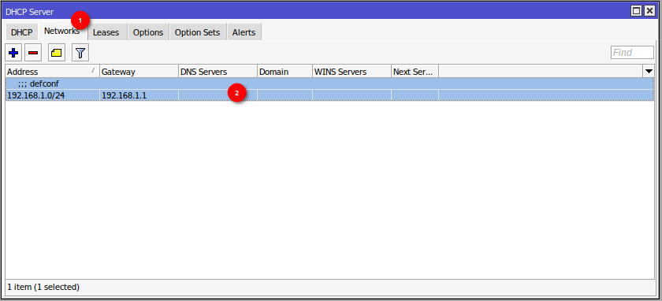

- W polu DNS Servers wpisz adres serwera DNS (tutaj przykładowo Cloudflare) :material-numeric-1-circle:
- Naciśnij Apply :material-numeric-2-circle: oraz OK :material-numeric-3-circle:, aby zamknąć okno.

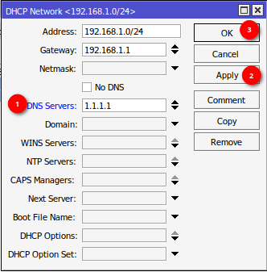

### Alternatywny serwer DNS

W celu dodania alternatywnego serwera DNS przejdź do ustawień serwera DNS.

- Naciśnij strzałkę w dół przy polu DNS Servers w celu dodania kolejnego wpisu :material-numeric-1-circle:
- Wpisz drugi serwer DNS (przykładowo Google) w utworzonym polu :material-numeric-2-circle:
- Naciśnij Apply :material-numeric-3-circle: oraz OK :material-numeric-4-circle:, aby zamknąć okno.

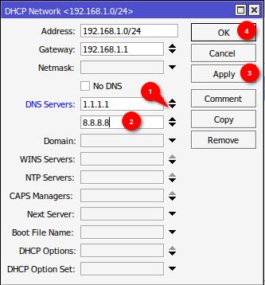

## Rezerwacja adresu IP

- Z menu po lewej stronie wybierz zakładkę IP :material-numeric-1-circle:
- Wybierz opcję DHCP Server :material-numeric-2-circle:

{ loading=lazy }

- Przejdź do zakładki Leases :material-numeric-1-circle:
- Naciśnij symbol plus :material-numeric-2-circle: w celu dodania nowej rezerwacji

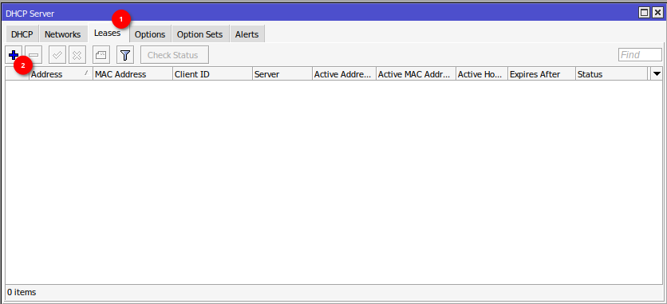{ loading=lazy }

- W polu Address :material-numeric-1-circle: wpisz adres IP jaki chcesz zarezerwować
- W polu MAC Address :material-numeric-2-circle: wpisz adres MAC urządzenia, dla którego ma być zarezerwowany adres
- Naciśnij Apply :material-numeric-3-circle: oraz OK :material-numeric-4-circle:, aby zamknąć okno.

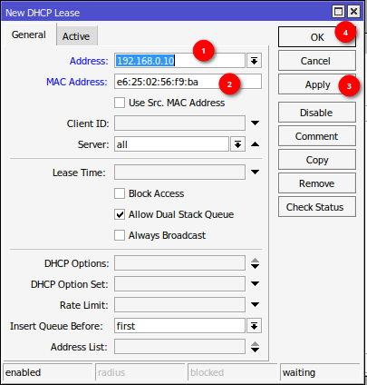{ loading=lazy }

??? tip "Jak sprawdzić adres MAC karty sieciowej w systemie GNU/Linux"
    Polecenie: `ip a`  
    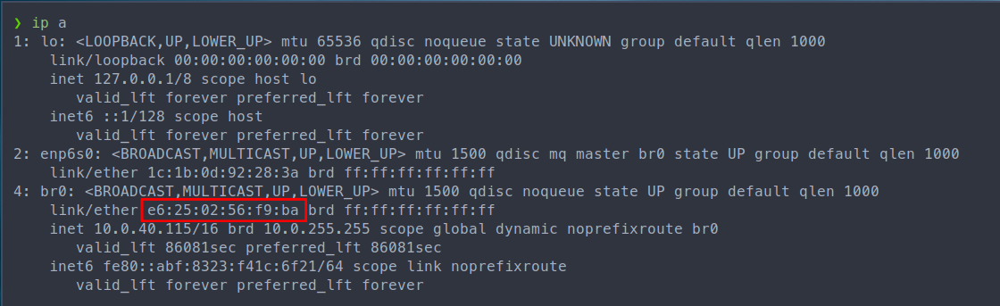

