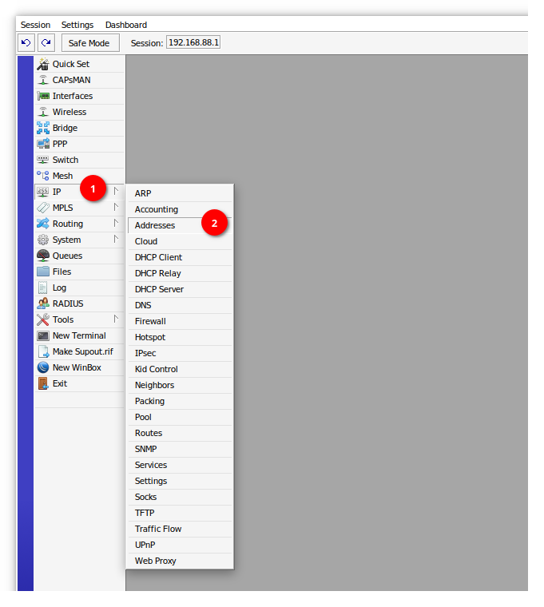
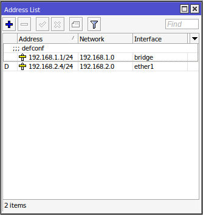
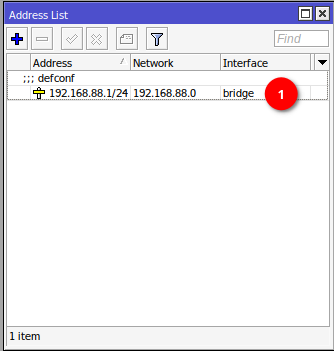
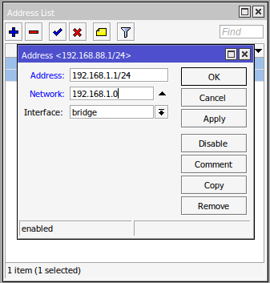

# Ustawienia IP

## Menu adresów IP

- Z menu po lewej stronie wybierz zakładkę IP :material-numeric-1-circle:
- Wybierz opcję Addresses :material-numeric-2-circle:

{ loading=lazy }

## Zmiana adresu IP LAN routera

- Dwukrotnie kliknij adres IP przy interfejsie bridge :material-numeric-1-circle:

{ loading=lazy }

- W polu Address wpisz adres IP z maską w notacji CIDR
- W polu Network wpisz adres sieci, w której znajduje się powyższy adres (bez maski)
- Naciśnij Apply oraz OK, aby zamknąć okno

Przykładowo dla adresu IP 192.168.1.1 z maską 255.255.255.0 - czyli 24 bitową w notacji CIDR, w polu Network należy wpisać sieć 192.168.1.0

??? tip "Notacja CIDR"
    Wytłumaczenie i tabelę masek można znaleźć pod poniższym linkiem:  
    [https://pl.wikipedia.org/wiki/Classless_Inter-Domain_Routing](https://pl.wikipedia.org/wiki/Classless_Inter-Domain_Routing)

{ loading=lazy }

Po dokonaniu zmiany serwer DHCP nie będzie automatycznie przydzielał poprawnego adresu IP. Należy zmienić ustawienia ręcznie.