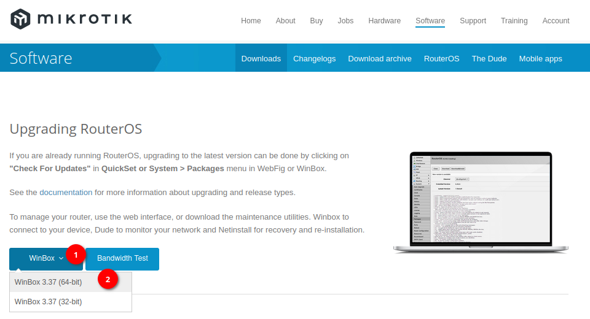
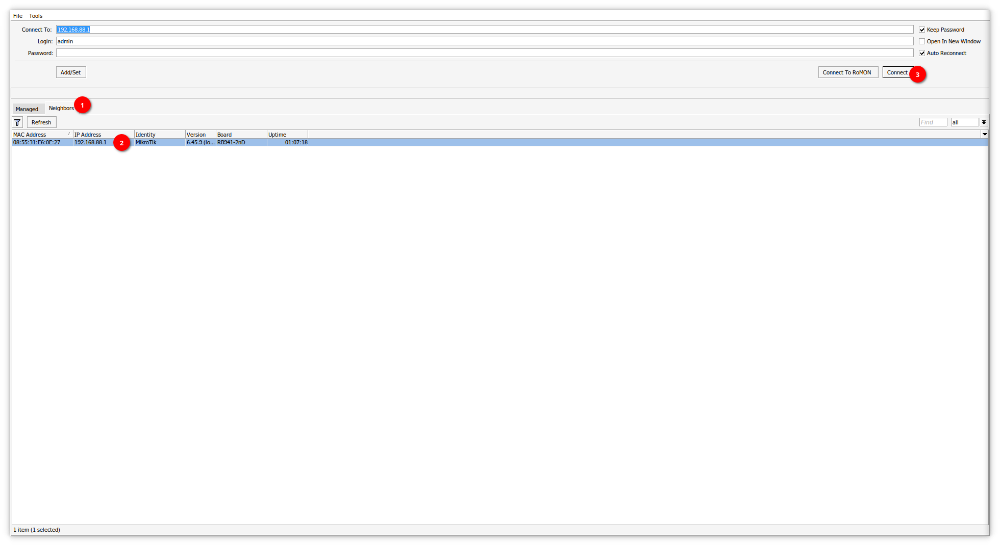
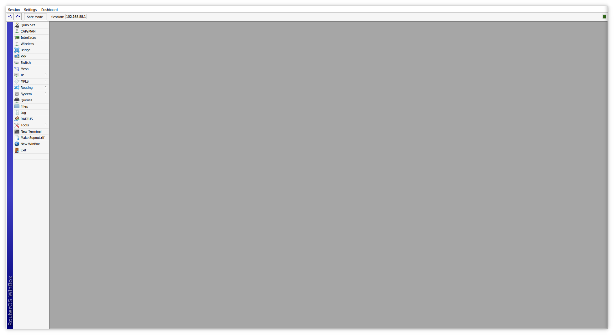

# Konfiguracja wstępna

## Podłączenie 

- Podłącz komputer do portu `eth2` na urządzeniu.
- Podłącz internet do portu `eth1` na urządzeniu.
- Ustaw automatyczne pobieranie adresu na komputerze (DHCP).

Router automatycznie przydzieli adres z sieci 192.168.88.0/24.

## Panel administracyjny

??? info "WinBox"
    Pobierz aplikację WinBox z tej strony: [https://mikrotik.com/download](https://mikrotik.com/download)
    ??? info "Screenshot"
        { loading=lazy }

- Otwórz aplikację WinBox
- Wejdź w zakładkę 'Neighbors' :material-numeric-1-circle:
- Wybierz adres IP routera :material-numeric-2-circle:
!!! warning "IP vs MAC"
    **Wybierając Adres IP, połączenie zostanie utracone w przypadku zmiany adresu IP urządzenia. W przypadku wybrania adresu MAC, nie stanie się tak.**
- Połącz się używając przycisku 'Connect' :material-numeric-3-circle:

!!! tip 
    Domyślny użytkownik to `admin` z pustym hasłem.

{ loading=lazy }

Po zalogowaniu pokaże się panel administracyjny:
{ loading=lazy }