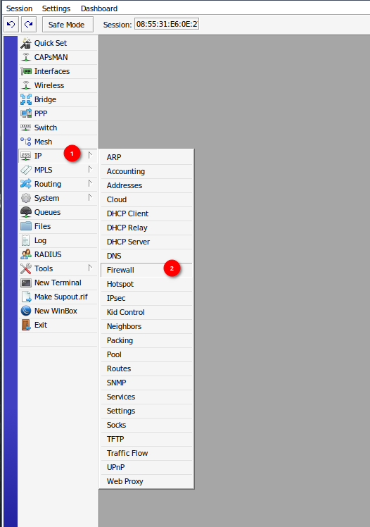
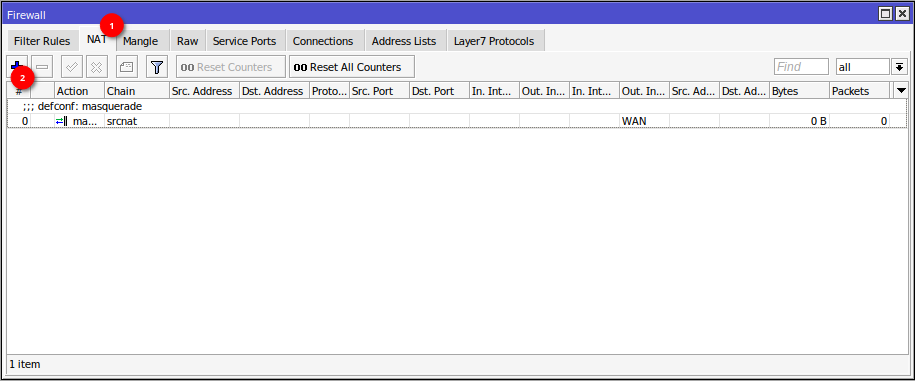
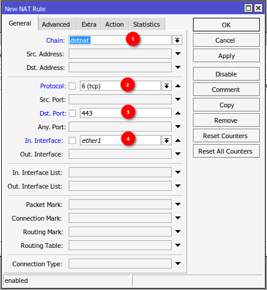
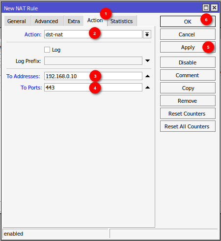

# Przekierowanie portów

- Z menu po lewej stronie wybierz zakładkę IP :material-numeric-1-circle:
- Wybierz opcję Firewall :material-numeric-2-circle:

{ loading=lazy }

- Przejdź do zakładki NAT :material-numeric-1-circle:
- Naciśnij symbol plus :material-numeric-2-circle: w celu dodania nowej zasady

{ loading=lazy }

- W polu Chain :material-numeric-1-circle: wybierz `dstnat`
- W polu Protocol :material-numeric-2-circle: wybierz `tcp` lub `udp` w zależności od potrzeb
- W polu Dst. Port :material-numeric-3-circle: wpisz port, który ma być przekierowany (przykładowo HTTPS)
- W polu In. Interface :material-numeric-4-circle: wybierz interfejs WAN (w tym przypadku `ether1`)

{ loading=lazy }

- Przejdź do zakładki Action :material-numeric-1-circle:
- W polu Action wybierz `dst-nat` :material-numeric-2-circle:
- W polu To Address :material-numeric-3-circle: wpisz adres IP na który ma być przekierowany port 
- W polu To Ports :material-numeric-4-circle: wpisz docelowy port (przykładowo HTTPS)
- Naciśnij Apply :material-numeric-5-circle: oraz OK :material-numeric-6-circle:, aby zamknąć okno.

{ loading=lazy }