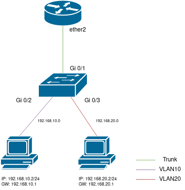
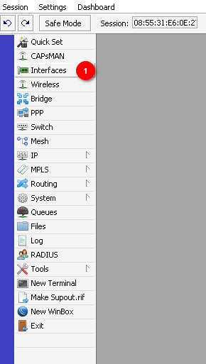
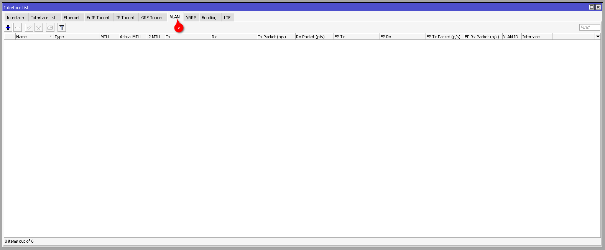
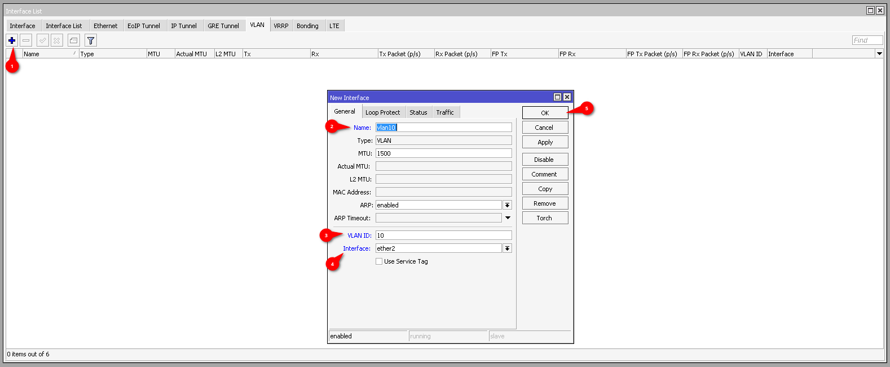
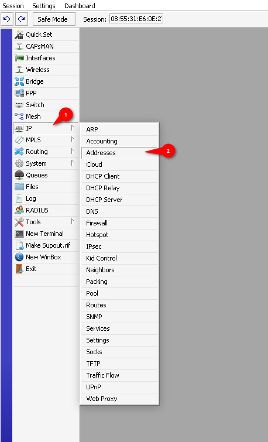
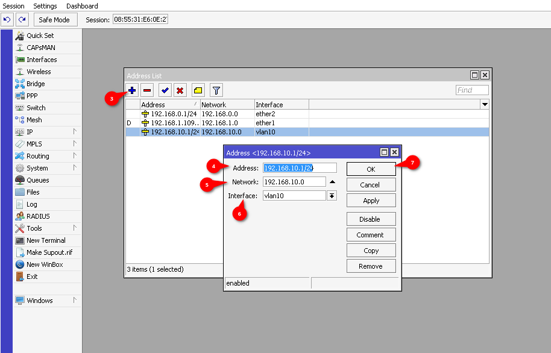

# VLAN - podstawy (Layer 3)

## Wstęp

W tym poradniku dowiesz się, jak skonfigurować VLAN na routerze MikroTik w modelu *"Router on a stick"*.

**Router on a stick** to konfiguracja, w której wszystkie VLANy są tworzone na routerze w warstwie 3. na jednym interfejsie fizycznym i są one rozdzielane za pomocą tagów VLAN na switchu w warstwie drugiej.

{ loading=lazy }

## Podstawowe ustawienia VLAN

- Z menu po lewej stronie wybierz zakładkę Interfaces :material-numeric-1-circle:
<!-- - Wybierz opcję DHCP Server :material-numeric-2-circle: -->

{ loading=lazy }

- Przejdź do zakładki VLAN :material-numeric-2-circle:

{ loading=lazy }

## Tworzenie VLAN

- Naciśnij przycisk + :material-numeric-1-circle: w celu dodania nowej konfiguracji VLAN
- W polu Name :material-numeric-2-circle: wpisz nazwę VLAN 
- W polu VLAN ID :material-numeric-3-circle: wpisz ID VLAN 
- W polu Interface :material-numeric-4-circle: wybierz interfejs, na którym ma być tworzony VLAN  
(VLAN musi być tworzony na interfejsie, a nie na bridge)
- Nachnij przycisk OK :material-numeric-5-circle: w celu zapisania konfiguracji

{ loading=lazy }

## Przydzielanie adresu IP do interfejsu VLAN

- Z menu po lewej stronie wybierz zakładkę IP :material-numeric-1-circle:
- Wybierz opcję Addresses :material-numeric-2-circle:
- Naciśnij przycisk + :material-numeric-3-circle: w celu dodania nowego adresu IP
- W polu Address :material-numeric-4-circle: wpisz adres IP  
(Przyjęło się stosować adresy w formacie `10.0.X.1/24`, gdzie `X` to ID VLAN)
- W polu Network :material-numeric-5-circle: wpisz adres sieci
- W polu Interface :material-numeric-6-circle: wybierz interfejs VLAN
- Nachnij przycisk OK :material-numeric-7-circle: w celu zapisania konfiguracji

{ loading=lazy }  
{ loading=lazy }

W tym momencie VLAN jest już skonfigurowany i gotowy do użycia.  
Zaleca się skonfigurowanie Serwera DHCP dla tego interfejsu, aby urządzenia podłączone do VLANu mogły otrzymać adres IP. [Przejdź do konfiguracji DHCP](/mikrotik/dhcp)

## Konfiguracja switcha

Switch musi być skonfigurowany w taki sposób, aby przekazywał tagi VLAN do portu, na którym jest podłączony router.
